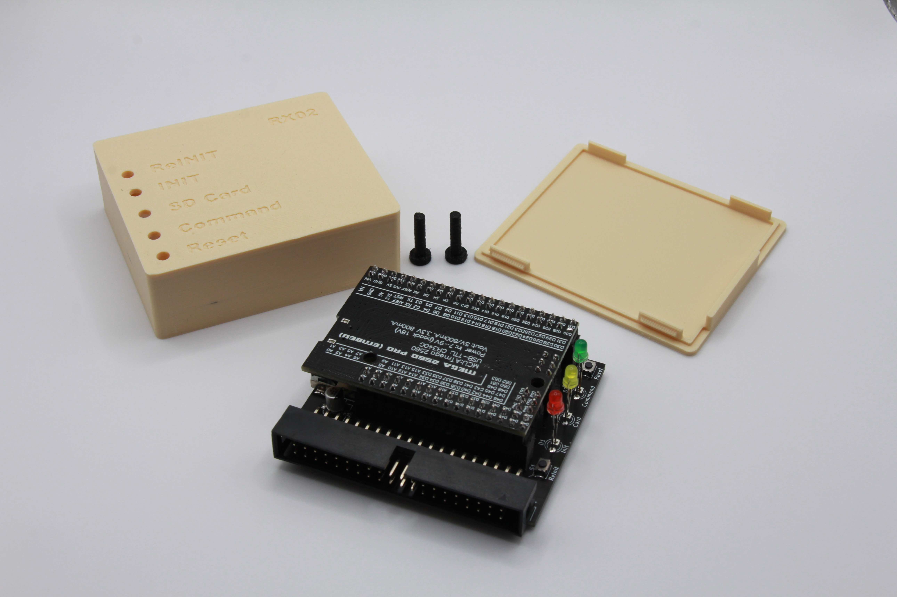
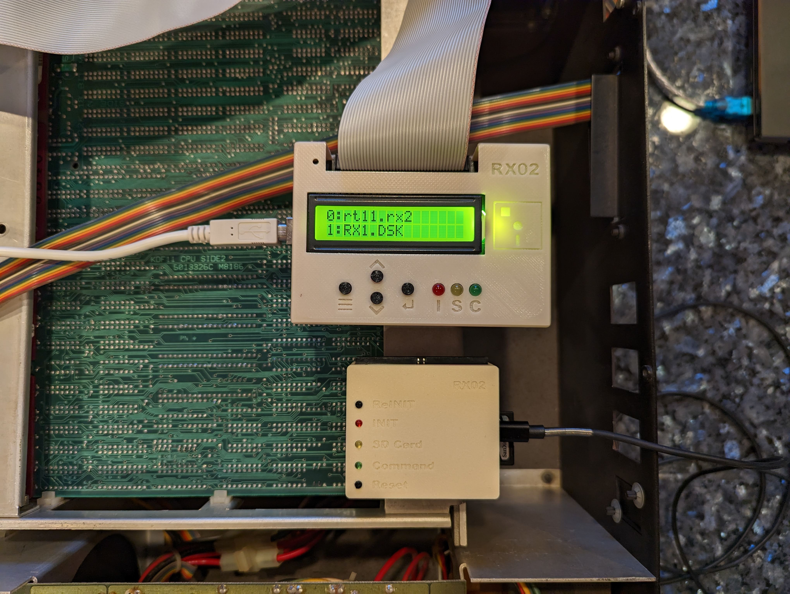
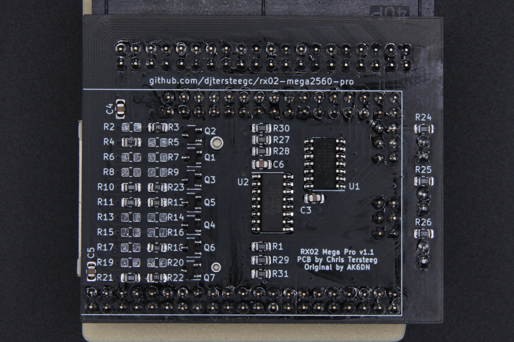
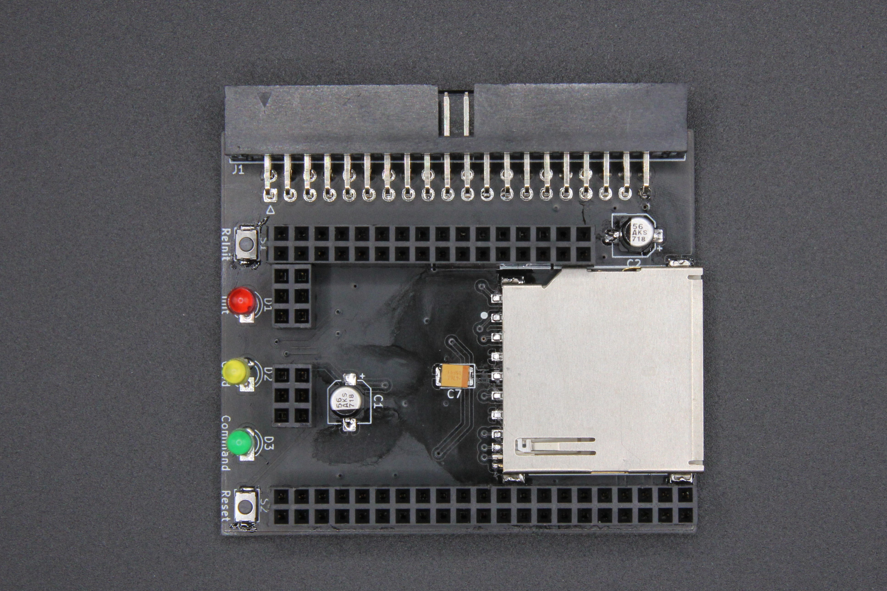
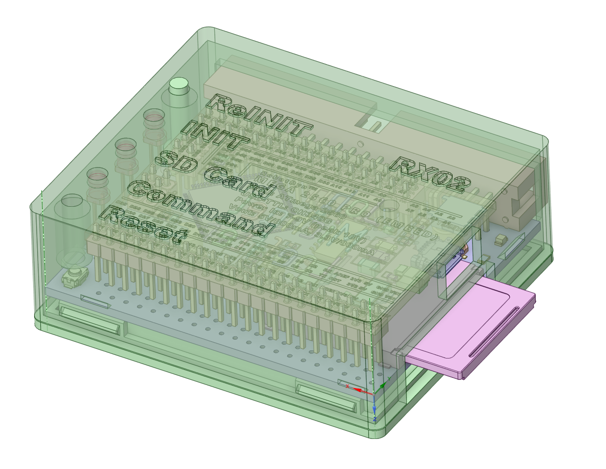
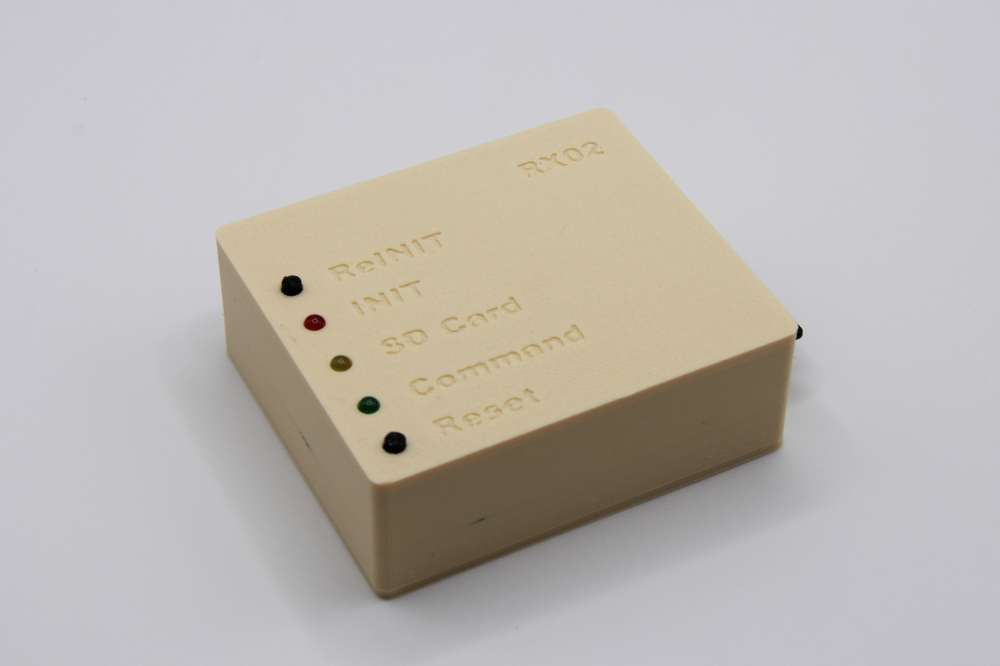
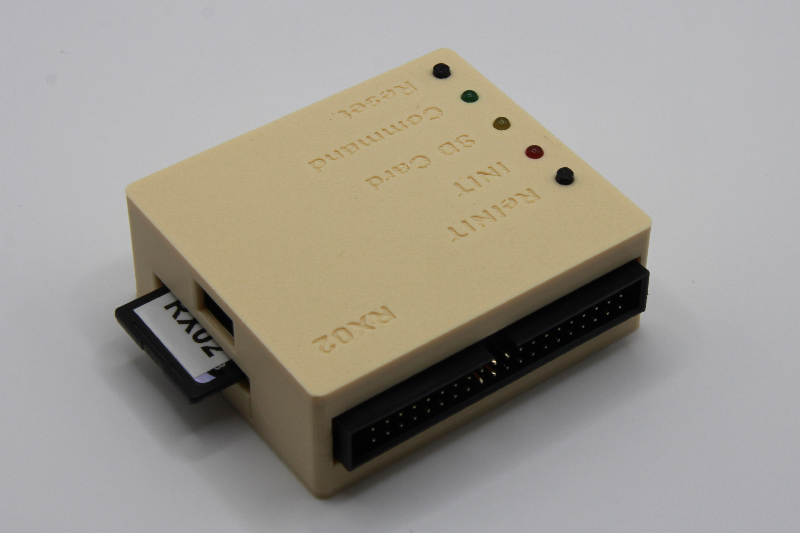

Mega 2560 Pro Embed version on [AK6DN's DEC RX02 emulator](https://github.com/AK6DN/rx02_emulator) board design and code.  There is a fork of his project at  https://github.com/djtersteegc/rx02_emulator that adds software support for this new board design. This was an exercise in how small I could make it while still using a Mega2560 shield and large'ish 0805 SMD parts for an easy DIY build.  If you are interested in a larger version built on a standard Arduino Mega 2560  with an LCD and buttons so you don't need to pick images via a serial/terminal connection, see my other project at https://github.com/djtersteegc/rx02-emulator-mega-shield.

Here's the two of them side by side on a Heathkit H11 for a size comparison.

See the VCFed thread at https://forum.vcfed.org/index.php?threads/building-the-worlds-currently-smallest-rx02-emulator.1240496/ for discussion or help with this project

# BOM

There is an interactive BOM at https://djtersteegc.github.io/rx02-mega2560-pro/ibom-v1.2.html  It's for a version 1.2 board which is hasn't been produced yet so ignore R32 and D4 which are for a power indicator LED if you are building a version 1.1 board.

C1 and C2 are bulk storage caps for the 5V rail, any value over 33uF should do.  C7 is a 47uF tantalum to prevent sag on the 3.3V rail when hot swapping the SD card since there is usually quite a bit of in rush current.  You can probably do without, especially if you never intend to hot swap since it's not really supported by the firmware.

# Assembly

This time around I used the same resistor references as AK6DN's original version so his resistor stuffing table is the same. Most of the resistor footprints should NOT be populated.

| Signal         | Resistor | Value   | Resistor | Value   |
| -------------- | -------- | ------- | -------- | ------- |
| RX_DMA_MODE_H  | R2       | -       | R3       | **390** |
| RX_AC_L        | R4       | **120** | R5       | -       |
| RX_OUT_L       | R6       | -       | R7       | -       |
| RX_SHIFT_L     | R8       | -       | R9       | -       |
| RX_12BIT_L     | R10      | **180** | R23      | **390** |
| RX_DATA_L      | R11      | **180** | R12      | **390** |
| RX_DONE_L      | R13      | -       | R14      | -       |
| RX_XFER_RQST_L | R15      | -       | R16      | -       |
| RX_INIT_L      | R17      | -       | R18      | **390** |
| RX_ERROR_L     | R19      | -       | R20      | -       |
| RX_RUN_L       | R21      | **180** | R22      | **390** |

Assemble the top side first.

Then flip in over and do the bottom.  Followed by the headers and then the 40 pin connector. For the LED's, I first insert them in the PCB, then the PCB in the case, flip it over and support the case ~1mm off the work surface for the LED's to just poke through the top and get a nice reveal. Solder one leg on the LED's, flip it over to check your spacing again, and then solder the other leg.

# Case

Make sure to print two copies of the buttoms. Angle the board in connector side first and it should drop in.  It's a snap fit design, so no screws needed to assemble.

# Flashing and Usage

See instructions at https://github.com/djtersteegc/rx02_emulator

# Getting a Board

If you are in the US, hit me up on the [VCFed thread](https://forum.vcfed.org/index.php?threads/building-the-worlds-currently-smallest-rx02-emulator.1240496/) above and if I still have extras, I can drop one in the mail for a couple of bucks. Otherwise, grab the gerbers and fab your own.

# Hardware Revisions

### Version 1.0

Required bodge wires since I failed to pick interrupt enabled pins on the Mega2560 for the RX_INIT and RX_RUN lines when I reamapped the pins to better fit this layout.

### Versions 1.1 (Current)

Working

### Version 1.2 (Not Produced Yet)

Added a power LED

  